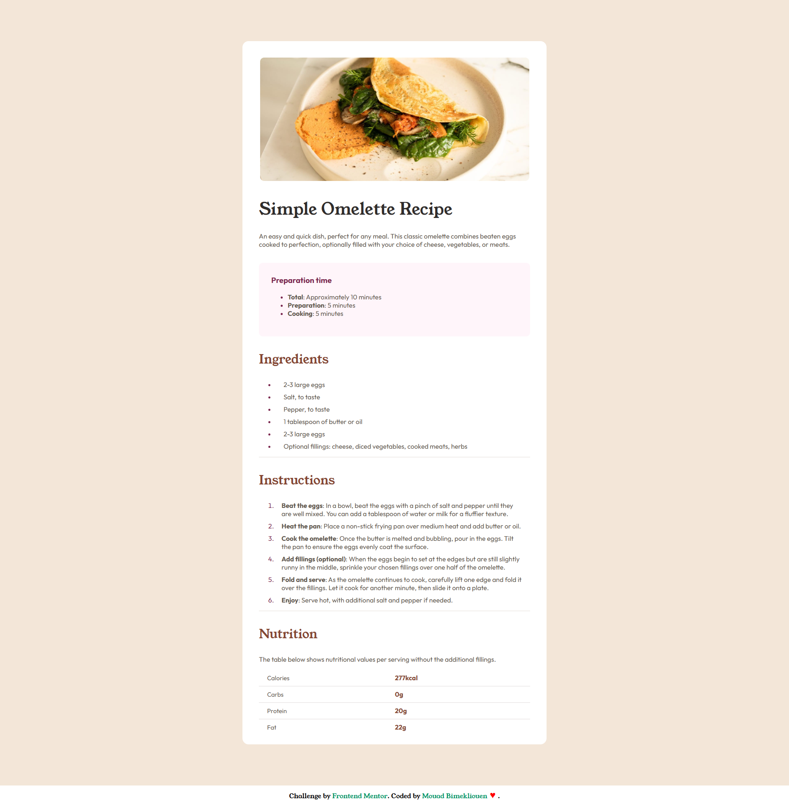

<h1>Recipe Page - A Beautiful and Responsive Recipe Website</h1>

<b>This project is a fully responsive recipe page built using HTML, SCSS, and CSS. It showcases a clean and modern design with detailed recipe cards, ingredients lists, and preparation steps. The layout is optimized for both desktop and mobile views. The code is structured to be clean and easy to maintain, leveraging SCSS for styling and modularity. Perfect for learning the basics of front-end web development and creating an aesthetically pleasing recipe page.</b>

<a href="" style="color:red;font-size:17px;margin:10px">Preview</a>

